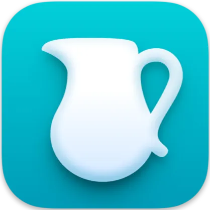
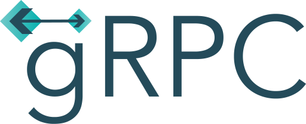
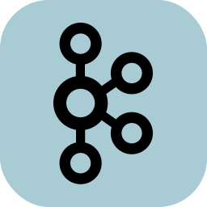
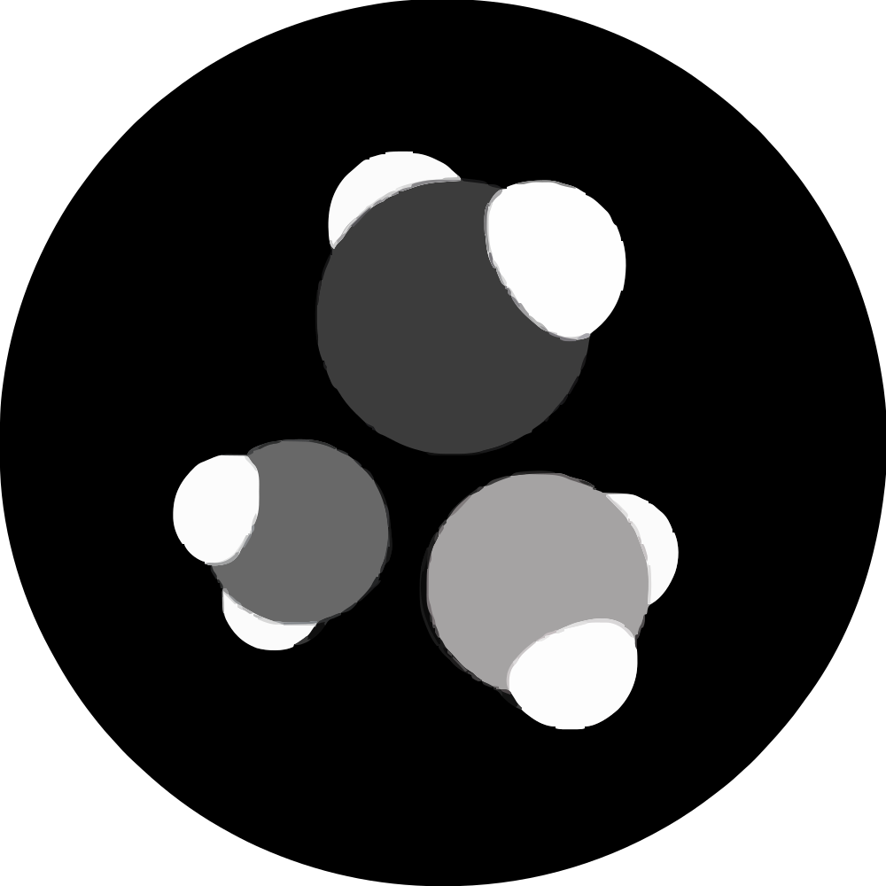
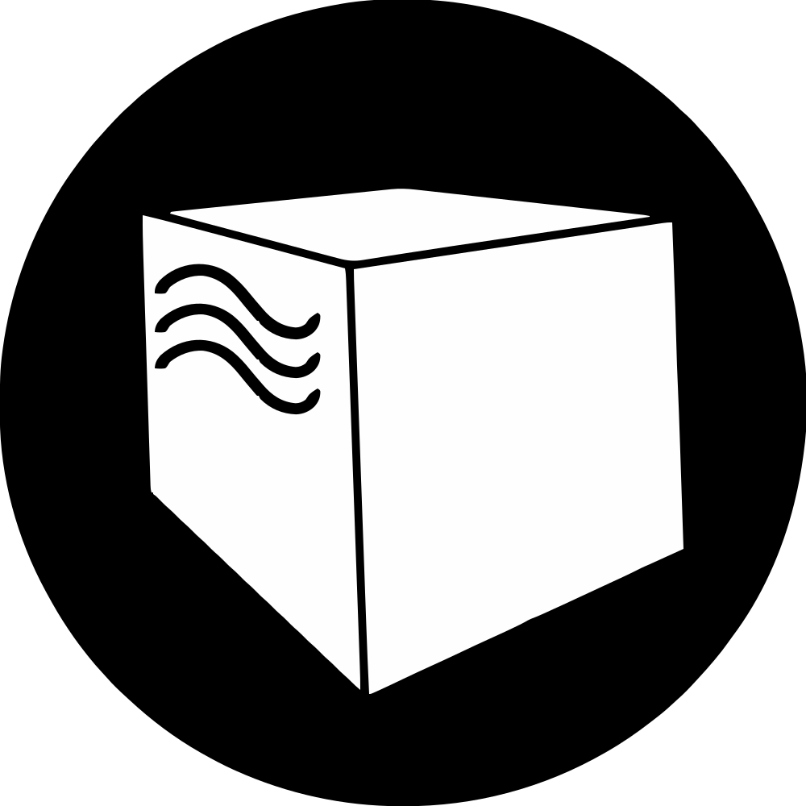
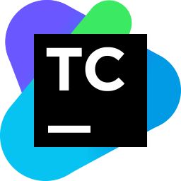

<h1 align="center">Hi there, I'm <a href="https://arrnel.github.io/" target="_blank">Dmitriy</a> </h1>
<h3 align="center">QA Automation Engineer</h3>
I'm a QA engineer and UI/API automation specialist with experience since 2019. Passionate about building robust testing
frameworks and currently learning Spring Boot development. My goal is to ensure software quality and streamline testing 
processes.

## 🤙🏻 Connect with me:

 

## ⚒️ Skills
### Manual Testing

### Automation Testing

  

&nbsp &nbsp &nbsp
  <b>Common:</b>
  
  
  
  
  

&nbsp &nbsp &nbsp
  <b>DB:&nbsp &nbsp &nbsp &nbsp &nbsp &nbsp &nbsp</b>
  
  
  

&nbsp &nbsp &nbsp
  <b>API:&nbsp &nbsp &nbsp &nbsp &nbsp &nbsp</b>
  
  
  
  
  

&nbsp &nbsp &nbsp
  <b>UI:&nbsp &nbsp &nbsp &nbsp &nbsp &nbsp &nbsp</b>
  
  
  

&nbsp &nbsp &nbsp
  <b>CI/CD:&nbsp &nbsp &nbsp &nbsp &nbsp</b>
  
  
  

### Dev

  
  
  

## 📊 Stats

 

## 💻 Projects

## 📈 Development plan
- Playwright (Java) + Moon `<-- current`
- K8s
- Quarkus + GraalVM
- Spring AI (by [Evgeniy Borisov](https://github.com/Jeka1978))
- New Programming Language
